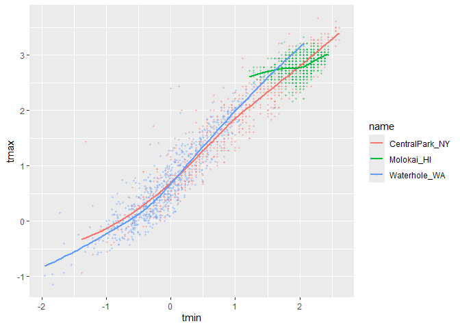
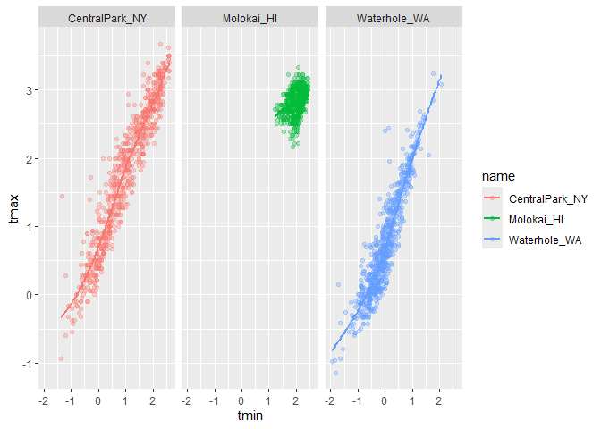
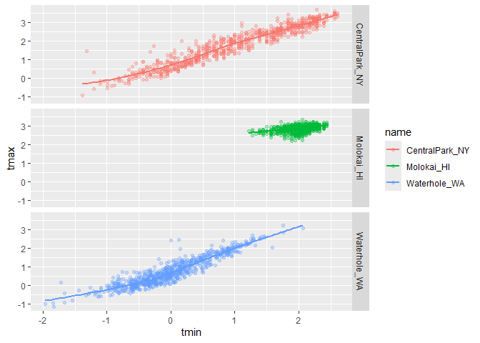
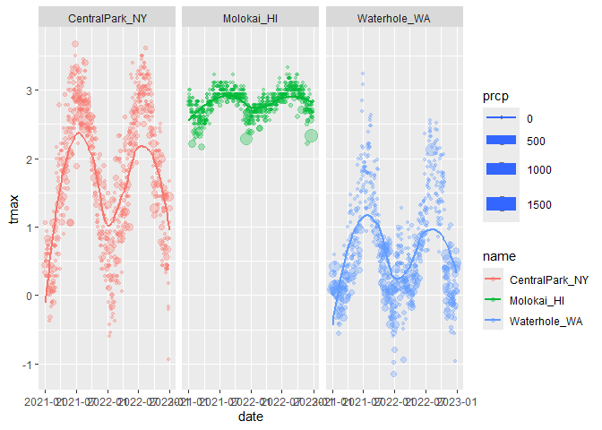
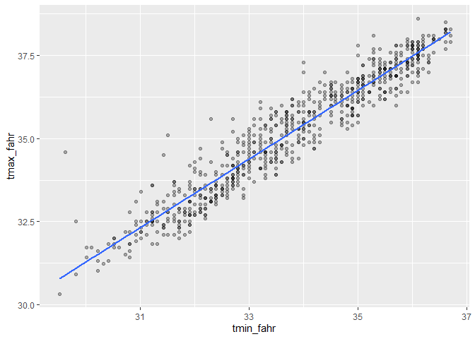

Vis_1
================

Import weather data

``` r
weather_df = read_csv("weather_df.csv")
weather_df = 
  mutate( weather_df,
    name = case_match(
      id, 
      "USW00094728" ~ "CentralPark_NY", 
      "USW00022534" ~ "Molokai_HI",
      "USS0023B17S" ~ "Waterhole_WA"), # creat new name variables.
    tmin = tmin / 10,
    tmax = tmax / 10) |>
  select(name, id, everything())
```

Make our first plot

``` r
ggplot(weather_df, aes(x = tmin, y = tmax)) +
  geom_point()
```

<!-- -->

``` r
weather_df |> 
  ggplot(aes(x = tmin, y = tmax)) +
  geom_point()
```

<!-- -->

``` r
ggp_weather_scatterplot = 
  weather_df |> 
  ggplot(aes(x = tmin, y = tmax)) +
  geom_point()

ggp_weather_scatterplot
```

<!-- -->

Check why some rows are missing.

``` r
weather_df |> 
  filter(is.na(tmax))
```

    ## # A tibble: 17 × 6
    ##    name         id          date        prcp  tmax  tmin
    ##    <chr>        <chr>       <date>     <dbl> <dbl> <dbl>
    ##  1 Molokai_HI   USW00022534 2022-05-31    NA    NA    NA
    ##  2 Waterhole_WA USS0023B17S 2021-03-09    NA    NA    NA
    ##  3 Waterhole_WA USS0023B17S 2021-12-07    51    NA    NA
    ##  4 Waterhole_WA USS0023B17S 2021-12-31     0    NA    NA
    ##  5 Waterhole_WA USS0023B17S 2022-02-03     0    NA    NA
    ##  6 Waterhole_WA USS0023B17S 2022-08-09    NA    NA    NA
    ##  7 Waterhole_WA USS0023B17S 2022-08-10    NA    NA    NA
    ##  8 Waterhole_WA USS0023B17S 2022-08-11    NA    NA    NA
    ##  9 Waterhole_WA USS0023B17S 2022-08-12    NA    NA    NA
    ## 10 Waterhole_WA USS0023B17S 2022-08-13    NA    NA    NA
    ## 11 Waterhole_WA USS0023B17S 2022-08-14    NA    NA    NA
    ## 12 Waterhole_WA USS0023B17S 2022-08-15    NA    NA    NA
    ## 13 Waterhole_WA USS0023B17S 2022-08-16    NA    NA    NA
    ## 14 Waterhole_WA USS0023B17S 2022-08-17    NA    NA    NA
    ## 15 Waterhole_WA USS0023B17S 2022-08-18    NA    NA    NA
    ## 16 Waterhole_WA USS0023B17S 2022-08-19    NA    NA    NA
    ## 17 Waterhole_WA USS0023B17S 2022-12-31    76    NA    NA

## Fancier scatterplots!

``` r
weather_df |> 
  ggplot(aes(x = tmin, y = tmax, color = name)) + # 3line
  geom_point(alpha = .3, size = .8) +
  geom_smooth(se = FALSE)
```

<!-- -->

Where you define aesthetics can matter

``` r
weather_df |> 
  ggplot(aes(x = tmin, y = tmax)) +
  geom_point(aes(color = name), alpha = .3, size = .8) + # 1line
  geom_smooth(se = FALSE)
```

<!-- -->

Use faceting real quick

``` r
weather_df |> 
  ggplot(aes(x = tmin, y = tmax, color = name)) +
  geom_point(alpha = .3) + 
  geom_smooth(se = FALSE) +
  facet_grid(. ~ name) # sep by name 
```

<!-- -->

``` r
weather_df |> 
  ggplot(aes(x = tmin, y = tmax, color = name)) +
  geom_point(alpha = .3) + 
  geom_smooth(se = FALSE) +
  facet_grid(name ~ .) # sep by name 
```

<!-- -->

Let’s make a somewhat more interesting scatterplot!

``` r
weather_df |> 
  ggplot(aes(x = date, y = tmax, color = name, size = prcp)) + # dif size of point
  geom_point(alpha = .3) + 
  geom_smooth(se = FALSE) +
  facet_grid(. ~ name) # sep by name 
```

<!-- -->

``` r
weather_df |> 
  filter(name == "CentralPark_NY") |> 
  mutate(
    tmax_fahr = tmax * (9 / 5) + 32,
    tmin_fahr = tmin * (9 / 5) + 32
  ) |> 
  ggplot(aes(x = tmin_fahr, y = tmax_fahr)) + 
  geom_point(alpha = .3) + 
  geom_smooth(method = "lm", se = FALSE)  
```

<!-- -->
