Vis_1
================

Import weather data

``` r
weather_df = read_csv("weather_df.csv")
weather_df = 
  mutate( weather_df,
    name = case_match(
      id, 
      "USW00094728" ~ "CentralPark_NY", 
      "USW00022534" ~ "Molokai_HI",
      "USS0023B17S" ~ "Waterhole_WA"), # creat new name variables.
    tmin = tmin / 10,
    tmax = tmax / 10) |>
  select(name, id, everything())
```

Make our first plot

``` r
ggplot(weather_df, aes(x = tmin, y = tmax)) +
  geom_point()
```

<!-- -->

``` r
weather_df |> 
  ggplot(aes(x = tmin, y = tmax)) +
  geom_point()
```

<!-- -->

``` r
ggp_weather_scatterplot = 
  weather_df |> 
  ggplot(aes(x = tmin, y = tmax)) +
  geom_point()

ggp_weather_scatterplot
```

<!-- -->

Check why some rows are missing.

``` r
weather_df |> 
  filter(is.na(tmax))
```

    ## # A tibble: 17 × 6
    ##    name         id          date        prcp  tmax  tmin
    ##    <chr>        <chr>       <date>     <dbl> <dbl> <dbl>
    ##  1 Molokai_HI   USW00022534 2022-05-31    NA    NA    NA
    ##  2 Waterhole_WA USS0023B17S 2021-03-09    NA    NA    NA
    ##  3 Waterhole_WA USS0023B17S 2021-12-07    51    NA    NA
    ##  4 Waterhole_WA USS0023B17S 2021-12-31     0    NA    NA
    ##  5 Waterhole_WA USS0023B17S 2022-02-03     0    NA    NA
    ##  6 Waterhole_WA USS0023B17S 2022-08-09    NA    NA    NA
    ##  7 Waterhole_WA USS0023B17S 2022-08-10    NA    NA    NA
    ##  8 Waterhole_WA USS0023B17S 2022-08-11    NA    NA    NA
    ##  9 Waterhole_WA USS0023B17S 2022-08-12    NA    NA    NA
    ## 10 Waterhole_WA USS0023B17S 2022-08-13    NA    NA    NA
    ## 11 Waterhole_WA USS0023B17S 2022-08-14    NA    NA    NA
    ## 12 Waterhole_WA USS0023B17S 2022-08-15    NA    NA    NA
    ## 13 Waterhole_WA USS0023B17S 2022-08-16    NA    NA    NA
    ## 14 Waterhole_WA USS0023B17S 2022-08-17    NA    NA    NA
    ## 15 Waterhole_WA USS0023B17S 2022-08-18    NA    NA    NA
    ## 16 Waterhole_WA USS0023B17S 2022-08-19    NA    NA    NA
    ## 17 Waterhole_WA USS0023B17S 2022-12-31    76    NA    NA

## Fancier scatterplots!

``` r
weather_df |> 
  ggplot(aes(x = tmin, y = tmax, color = name)) + # 3line
  geom_point(alpha = .3, size = .8) +
  geom_smooth(se = FALSE)
```

<!-- -->

Where you define aesthetics can matter

``` r
weather_df |> 
  ggplot(aes(x = tmin, y = tmax)) +
  geom_point(aes(color = name), alpha = .3, size = .8) + # 1line
  geom_smooth(se = FALSE)
```

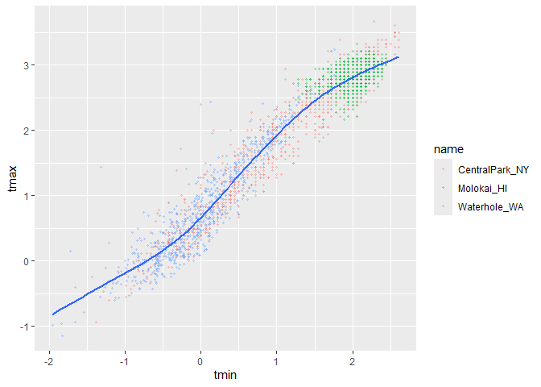<!-- -->

Use faceting real quick

``` r
weather_df |> 
  ggplot(aes(x = tmin, y = tmax, color = name)) +
  geom_point(alpha = .3) + 
  geom_smooth(se = FALSE) +
  facet_grid(. ~ name) # sep by name 
```

<!-- -->

``` r
weather_df |> 
  ggplot(aes(x = tmin, y = tmax, color = name)) +
  geom_point(alpha = .3) + 
  geom_smooth(se = FALSE) +
  facet_grid(name ~ .) # sep by name 
```

<!-- -->

Let’s make a somewhat more interesting scatterplot!

``` r
weather_df |> 
  ggplot(aes(x = date, y = tmax, color = name, size = prcp)) + # dif size of point
  geom_point(alpha = .3) + 
  geom_smooth(se = FALSE) +
  facet_grid(. ~ name) # sep by name 
```

<!-- -->

``` r
weather_df |> 
  filter(name == "CentralPark_NY") |> 
  mutate(
    tmax_fahr = tmax * (9 / 5) + 32,
    tmin_fahr = tmin * (9 / 5) + 32
  ) |> 
  ggplot(aes(x = tmin_fahr, y = tmax_fahr)) + 
  geom_point(alpha = .3) + 
  geom_smooth(method = "lm", se = FALSE)  
```

<!-- -->

## Small things

``` r
weather_df |> 
  ggplot(aes(x = tmin, y = tmax)) +
  # geom_point(aes(color = name), alpha = .3, size = .8) +
  geom_smooth(se = FALSE)
```

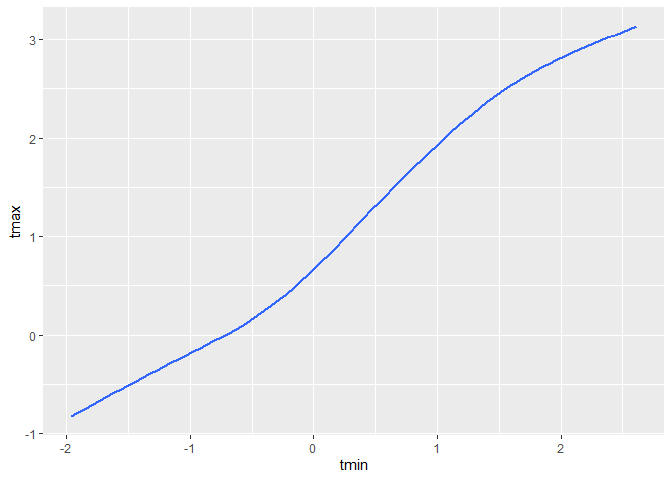<!-- -->

``` r
weather_df |> 
  ggplot(aes(x = tmin, y = tmax)) +
  geom_hex()
```

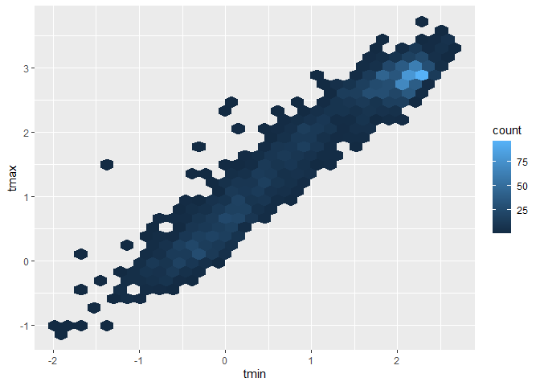<!-- -->

``` r
  #geom_hex(aes(color = name), alpha = .3, size = .8) +
  #geom_smooth(se = FALSE)
```

``` r
weather_df |> 
  ggplot(aes(x = tmin, y = tmax, color = "blue")) +
  geom_point()
```

    ## Warning: Removed 17 rows containing missing values or values outside the scale range
    ## (`geom_point()`).

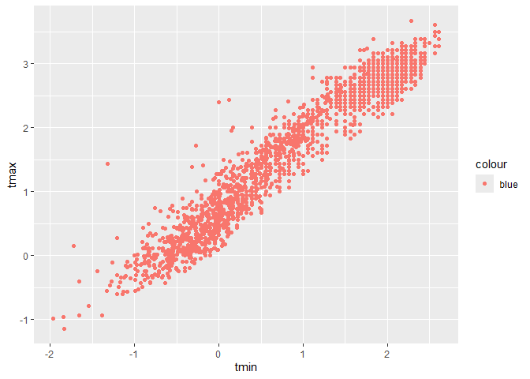<!-- -->

``` r
weather_df |> 
  ggplot(aes(x = tmin, y = tmax)) +
  geom_point(color = "blue") #right
```

    ## Warning: Removed 17 rows containing missing values or values outside the scale range
    ## (`geom_point()`).

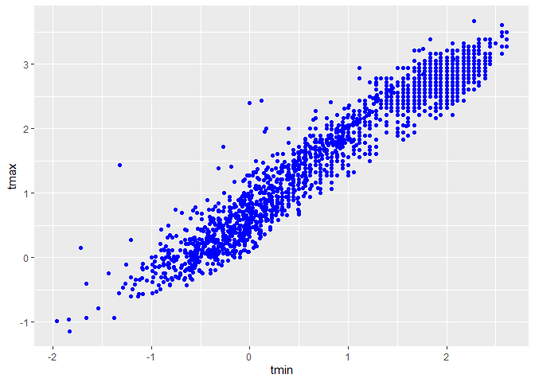<!-- -->

## Univariable plots

``` r
weather_df |> 
  ggplot(aes(x = tmin)) +
  geom_histogram()
```

    ## `stat_bin()` using `bins = 30`. Pick better value with `binwidth`.

    ## Warning: Removed 17 rows containing non-finite outside the scale range
    ## (`stat_bin()`).

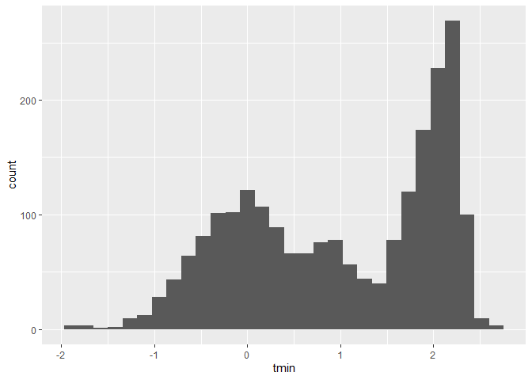<!-- -->

``` r
weather_df |> 
  ggplot(aes(x = tmin, colour = name )) +
  geom_histogram()
```

    ## `stat_bin()` using `bins = 30`. Pick better value with `binwidth`.

    ## Warning: Removed 17 rows containing non-finite outside the scale range
    ## (`stat_bin()`).

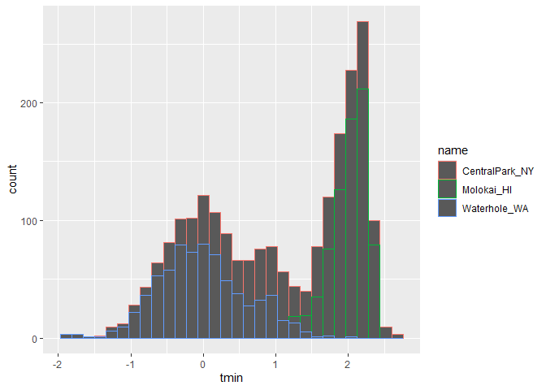<!-- -->

``` r
weather_df |> 
  ggplot(aes(x = tmin, fill = name )) +
  geom_histogram(position = "dodge")
```

    ## `stat_bin()` using `bins = 30`. Pick better value with `binwidth`.

    ## Warning: Removed 17 rows containing non-finite outside the scale range
    ## (`stat_bin()`).

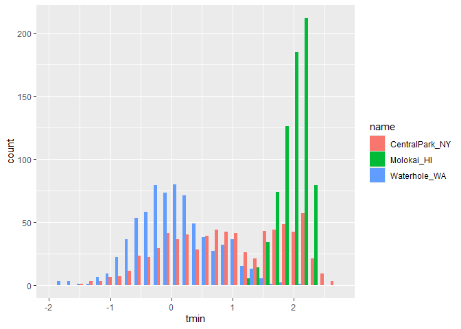<!-- -->

How would i fix this? Maybe facet?

``` r
weather_df |> 
  ggplot(aes(x = tmin, fill = name)) +
  geom_histogram() +
  facet_grid(. ~ name)
```

    ## `stat_bin()` using `bins = 30`. Pick better value with `binwidth`.

    ## Warning: Removed 17 rows containing non-finite outside the scale range
    ## (`stat_bin()`).

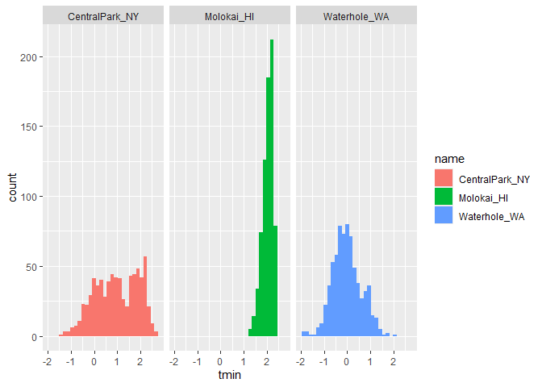<!-- -->

maybe a density plot?

``` r
weather_df |> 
  ggplot(aes(x = tmin, fill = name)) +
  geom_density(alpha = .3) +
  facet_grid(. ~ name)
```

    ## Warning: Removed 17 rows containing non-finite outside the scale range
    ## (`stat_density()`).

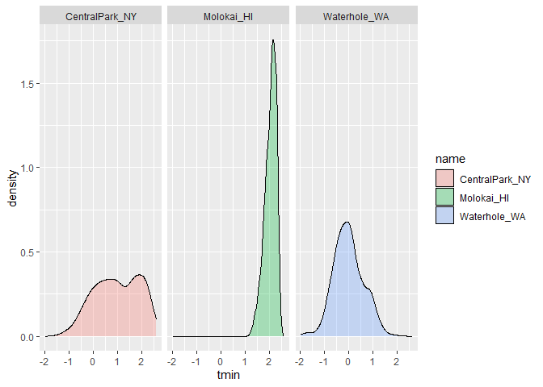<!-- -->

``` r
weather_df |> 
  ggplot(aes(x = name, y = tmin, fill = name)) +
  geom_boxplot(alpha = .3) +
  facet_grid(. ~ name)
```

    ## Warning: Removed 17 rows containing non-finite outside the scale range
    ## (`stat_boxplot()`).

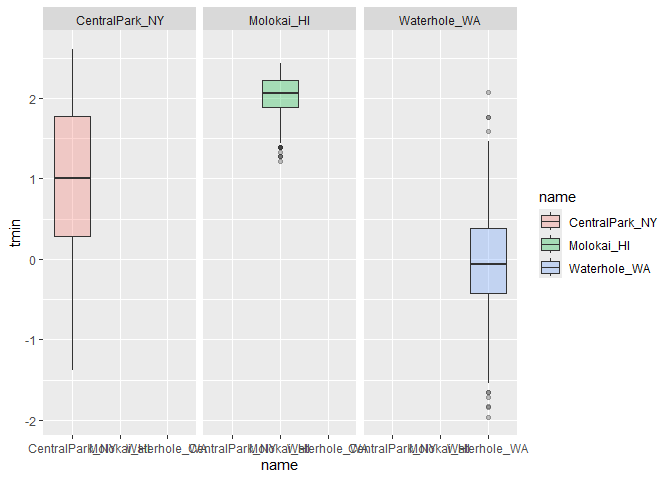<!-- -->

Violin plot

``` r
weather_df |> 
  ggplot(aes(x = name, y = tmin, fill = name)) +
  geom_violin(alpha = .3) 
```

    ## Warning: Removed 17 rows containing non-finite outside the scale range
    ## (`stat_ydensity()`).

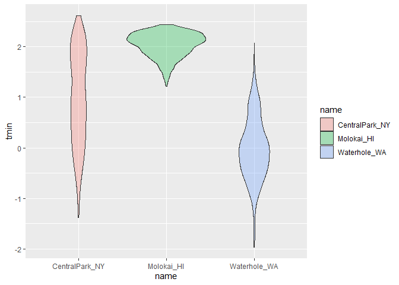<!-- -->

ridge plot

``` r
library(ggridges)
weather_df |> 
  ggplot(aes(x = tmin, y = name, fill = name)) +
  geom_density_ridges() 
```

    ## Picking joint bandwidth of 0.141

    ## Warning: Removed 17 rows containing non-finite outside the scale range
    ## (`stat_density_ridges()`).

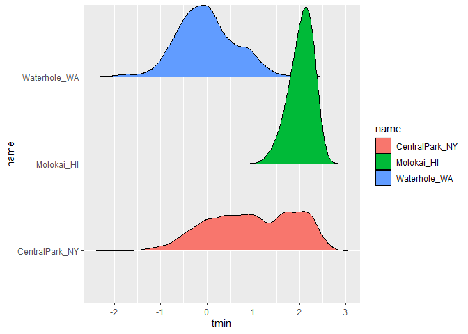<!-- -->

LA univariate plots

``` r
weather_df |> 
  ggplot(aes(x = prcp, fill = name)) +
  geom_density(alpha = .3)
```

    ## Warning: Removed 15 rows containing non-finite outside the scale range
    ## (`stat_density()`).

<!-- -->

``` r
weather_df |> 
  ggplot(aes(x = name, y = prcp, fill = name)) +
  geom_boxplot(alpha = .3)
```

    ## Warning: Removed 15 rows containing non-finite outside the scale range
    ## (`stat_boxplot()`).

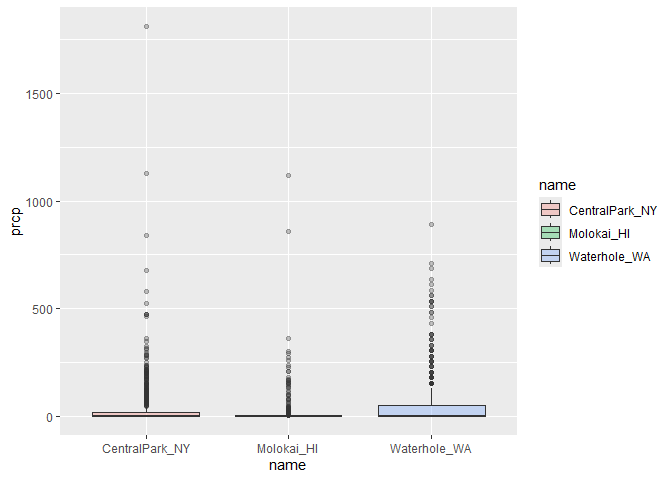<!-- -->

``` r
weather_df |> 
  filter(prcp > 10, prcp < 1000) |> 
  ggplot(aes(x = prcp, fill = name)) +
  geom_density(alpha = .3)
```

<!-- -->

## Saving and embedding plots

``` r
ggp_weather = 
  weather_df |> 
  ggplot(aes(x = date, y = tmax, color = name)) +
  geom_point()

ggsave("ggp_weather.pdf", ggp_weather, width = 8, height = 6)
```

    ## Warning: Removed 17 rows containing missing values or values outside the scale range
    ## (`geom_point()`).

embedding plots

``` r
weather_df |> 
  ggplot(aes(x = date, y = tmax, color = name)) +
  geom_point()
```

    ## Warning: Removed 17 rows containing missing values or values outside the scale range
    ## (`geom_point()`).

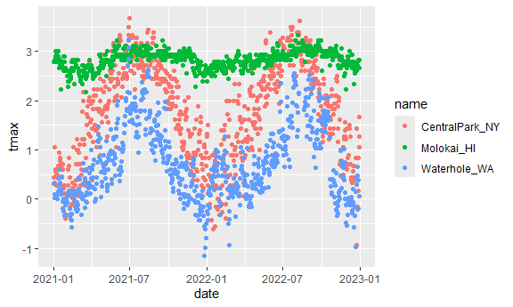<!-- -->
