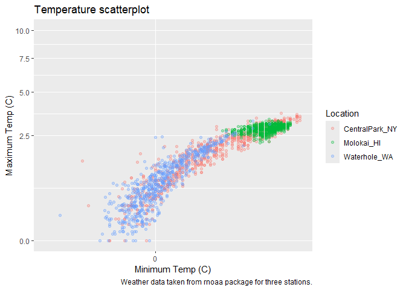
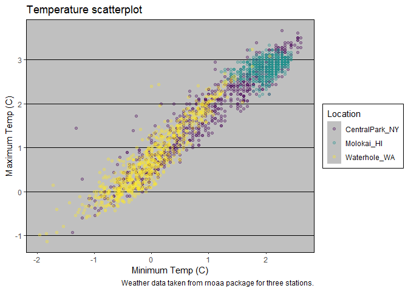

Vis_2
================

Import weather data

``` r
weather_df = read_csv("weather_df.csv")
weather_df = 
  mutate( weather_df,
    name = case_match(
      id, 
      "USW00094728" ~ "CentralPark_NY", 
      "USW00022534" ~ "Molokai_HI",
      "USS0023B17S" ~ "Waterhole_WA"), # creat new name variables.
    tmin = tmin / 10,
    tmax = tmax / 10) |>
  select(name, id, everything())
```

Make a scatterplot but fancy this time.

``` r
weather_df |> 
  ggplot(aes(x = tmin, y = tmax, color = name)) + 
  geom_point(alpha = .3) +
  labs(
    title = "Temperature scatterplot",
    x = "Minimum Temp (C)",
    y = "Maximum Temp (C)",
    color = "Location", 
    caption = "Weather data taken from rnoaa package for three stations."
  )
```

<!-- -->

Scales – start with `x` and `y` and `colour`

``` r
weather_df |> 
  ggplot(aes(x = tmin, y = tmax, color = name)) + 
  geom_point(alpha = .3) +
  labs(
    title = "Temperature scatterplot",
    x = "Minimum Temp (C)",
    y = "Maximum Temp (C)",
    color = "Location", 
    caption = "Weather data taken from rnoaa package for three stations."
  ) +
  scale_x_continuous(
    breaks = c(-15, 0, 20),
    labels = c("-15", "0", "20")
  ) +
  scale_y_continuous(
    limits = c(0, 10),
    transform = "sqrt"
  )
```

<!-- -->

Look at color

``` r
weather_df |> 
  ggplot(aes(x = tmin, y = tmax, color = name)) + 
  geom_point(alpha = .3) +
  labs(
    title = "Temperature scatterplot",
    x = "Minimum Temp (C)",
    y = "Maximum Temp (C)",
    color = "Location", 
    caption = "Weather data taken from rnoaa package for three stations."
  ) +
  #scale_color_hue(h = c(100, 400)) +
  viridis::scale_color_viridis(discrete = TRUE)
```

<!-- -->

## Themes

``` r
ggp_scatterplot = 
  weather_df |> 
  ggplot(aes(x = tmin, y = tmax, color = name)) + 
  geom_point(alpha = .3) +
  labs(
    title = "Temperature scatterplot",
    x = "Minimum Temp (C)",
    y = "Maximum Temp (C)",
    color = "Location", 
    caption = "Weather data taken from rnoaa package for three stations."
  ) +
  #scale_color_hue(h = c(100, 400)) +
  viridis::scale_color_viridis(discrete = TRUE)
```

``` r
ggp_scatterplot +
  theme(legend.position = "bottom")#lable place in bottom
```

<!-- -->

``` r
ggp_scatterplot +
  theme_bw() + # background is white vs grey upside.
  theme(legend.position = "bottom")
```

<!-- -->

Other matters

``` r
ggp_scatterplot +
  theme(legend.position = "bottom") + 
  theme_bw()
```

<!-- -->

``` r
ggp_scatterplot +
  theme(legend.position = "bottom") + 
  theme_minimal()#background without the lines
```

<!-- -->

``` r
ggp_scatterplot +
  theme(legend.position = "bottom") + 
  theme_classic() #background dif
```

<!-- -->

``` r
ggp_scatterplot +
  theme(legend.position = "bottom") + 
  ggthemes::theme_excel() #ugly
```

<!-- -->

New scatterplot

``` r
weather_df |> 
  ggplot(aes(x = date, y = tmax, colour = name, size = prcp)) +
  geom_point(alpha = .3) +
  geom_smooth(se = FALSE) +#no grey shadow
  viridis::scale_color_viridis(discrete = TRUE) +
  labs(
    x = "Date",
    y = "Maximum Temp (C)",
    title = "Seasonal variation in Max Temp",
    size = "Precipitation"
  ) +
  theme_minimal() +
  theme(legend.position = "bottom")
```

    ## `geom_smooth()` using method = 'loess' and formula = 'y ~ x'

<!-- -->

Extra bonus stuff in `ggplot`

Use different datasets in different `geom`s

``` r
central_park_df = 
  weather_df |> 
  filter(name == "CentralPark_NY")

molokai_df =
  weather_df |> 
  filter(name == "Molokai_HI")
  
molokai_df |> 
  ggplot(aes(x = date, y = tmax, colour = name)) +
  geom_point() +
  geom_line(data = central_park_df)
```

<!-- -->

## Multiple panels

``` r
weather_df |> 
  ggplot(aes(x = tmax, fill = name)) +
  geom_density() +
  facet_grid(. ~ name)
```

<!-- -->

``` r
ggp_tmax_tmin = 
  weather_df |> 
  ggplot(aes(x = tmin, y = tmax, color = name)) +
  geom_point(alpha = .3)
ggp_tmax_tmin
```

<!-- -->

``` r
ggp_tmax_density = 
  weather_df |>
  ggplot(aes(x = tmax, fill = name)) +
  geom_density(alpha = .3) 
ggp_tmax_density
```

<!-- -->

``` r
ggp_tmax_date = 
  weather_df |>
  ggplot(aes(x = date, y = tmax, color = name)) +
  geom_point(alpha = .3) +
  geom_smooth(se = FALSE)
ggp_tmax_date
```

    ## `geom_smooth()` using method = 'loess' and formula = 'y ~ x'

<!-- -->

``` r
#library(patchwork)
(ggp_tmax_tmin + ggp_tmax_density) / ggp_tmax_date# combine 2 plots 
```

    ## `geom_smooth()` using method = 'loess' and formula = 'y ~ x'

<!-- -->
