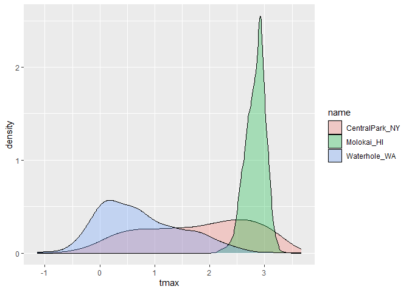
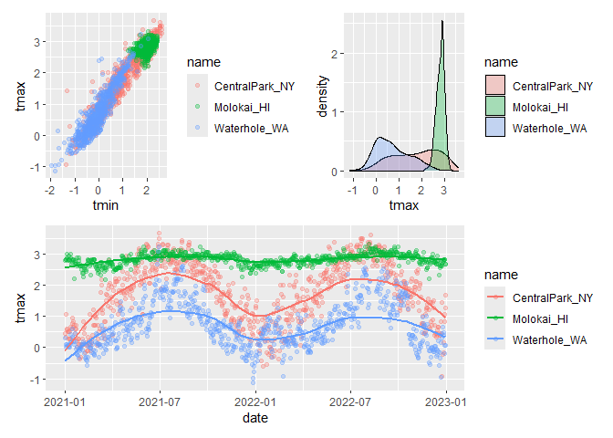

Vis_2
================

Import weather data

``` r
weather_df = read_csv("weather_df.csv")
weather_df = 
  mutate( weather_df,
    name = case_match(
      id, 
      "USW00094728" ~ "CentralPark_NY", 
      "USW00022534" ~ "Molokai_HI",
      "USS0023B17S" ~ "Waterhole_WA"), # creat new name variables.
    tmin = tmin / 10,
    tmax = tmax / 10) |>
  select(name, id, everything())
```

Make a scatterplot but fancy this time.

``` r
weather_df |> 
  ggplot(aes(x = tmin, y = tmax, color = name)) + 
  geom_point(alpha = .3) +
  labs(
    title = "Temperature scatterplot",
    x = "Minimum Temp (C)",
    y = "Maximum Temp (C)",
    color = "Location", 
    caption = "Weather data taken from rnoaa package for three stations."
  )
```

<!-- -->

Scales – start with `x` and `y` and `colour`

``` r
weather_df |> 
  ggplot(aes(x = tmin, y = tmax, color = name)) + 
  geom_point(alpha = .3) +
  labs(
    title = "Temperature scatterplot",
    x = "Minimum Temp (C)",
    y = "Maximum Temp (C)",
    color = "Location", 
    caption = "Weather data taken from rnoaa package for three stations."
  ) +
  scale_x_continuous(
    breaks = c(-15, 0, 20),
    labels = c("-15", "0", "20")
  ) +
  scale_y_continuous(
    limits = c(0, 10),
    transform = "sqrt"
  )
```

<!-- -->

Look at color

``` r
weather_df |> 
  ggplot(aes(x = tmin, y = tmax, color = name)) + 
  geom_point(alpha = .3) +
  labs(
    title = "Temperature scatterplot",
    x = "Minimum Temp (C)",
    y = "Maximum Temp (C)",
    color = "Location", 
    caption = "Weather data taken from rnoaa package for three stations."
  ) +
  #scale_color_hue(h = c(100, 400)) +
  viridis::scale_color_viridis(discrete = TRUE)
```

<!-- -->

## Themes

``` r
ggp_scatterplot = 
  weather_df |> 
  ggplot(aes(x = tmin, y = tmax, color = name)) + 
  geom_point(alpha = .3) +
  labs(
    title = "Temperature scatterplot",
    x = "Minimum Temp (C)",
    y = "Maximum Temp (C)",
    color = "Location", 
    caption = "Weather data taken from rnoaa package for three stations."
  ) +
  #scale_color_hue(h = c(100, 400)) +
  viridis::scale_color_viridis(discrete = TRUE)
```

``` r
ggp_scatterplot +
  theme(legend.position = "bottom")#lable place in bottom
```

<!-- -->

``` r
ggp_scatterplot +
  theme_bw() + # background is white vs grey upside.
  theme(legend.position = "bottom")
```

<!-- -->

Other matters

``` r
ggp_scatterplot +
  theme(legend.position = "bottom") + 
  theme_bw()
```

<!-- -->

``` r
ggp_scatterplot +
  theme(legend.position = "bottom") + 
  theme_minimal()#background without the lines
```

<!-- -->

``` r
ggp_scatterplot +
  theme(legend.position = "bottom") + 
  theme_classic() #background dif
```

<!-- -->

``` r
ggp_scatterplot +
  theme(legend.position = "bottom") + 
  ggthemes::theme_excel() #ugly
```

<!-- -->

New scatterplot

``` r
weather_df |> 
  ggplot(aes(x = date, y = tmax, colour = name, size = prcp)) +
  geom_point(alpha = .3) +
  geom_smooth(se = FALSE) +#no grey shadow
  viridis::scale_color_viridis(discrete = TRUE) +
  labs(
    x = "Date",
    y = "Maximum Temp (C)",
    title = "Seasonal variation in Max Temp",
    size = "Precipitation"
  ) +
  theme_minimal() +
  theme(legend.position = "bottom")
```

    ## `geom_smooth()` using method = 'loess' and formula = 'y ~ x'

<!-- -->

Extra bonus stuff in `ggplot`

Use different datasets in different `geom`s

``` r
central_park_df = 
  weather_df |> 
  filter(name == "CentralPark_NY")

molokai_df =
  weather_df |> 
  filter(name == "Molokai_HI")
  
molokai_df |> 
  ggplot(aes(x = date, y = tmax, colour = name)) +
  geom_point() +
  geom_line(data = central_park_df)
```

<!-- -->

## Multiple panels

``` r
weather_df |> 
  ggplot(aes(x = tmax, fill = name)) +
  geom_density() +
  facet_grid(. ~ name)
```

<!-- -->

``` r
ggp_tmax_tmin = 
  weather_df |> 
  ggplot(aes(x = tmin, y = tmax, color = name)) +
  geom_point(alpha = .3)
ggp_tmax_tmin
```

<!-- -->

``` r
ggp_tmax_density = 
  weather_df |>
  ggplot(aes(x = tmax, fill = name)) +
  geom_density(alpha = .3) 
ggp_tmax_density
```

<!-- -->

``` r
ggp_tmax_date = 
  weather_df |>
  ggplot(aes(x = date, y = tmax, color = name)) +
  geom_point(alpha = .3) +
  geom_smooth(se = FALSE)
ggp_tmax_date
```

    ## `geom_smooth()` using method = 'loess' and formula = 'y ~ x'

<!-- -->

``` r
#library(patchwork)
(ggp_tmax_tmin + ggp_tmax_density) / ggp_tmax_date# combine 2 plots 
```

    ## `geom_smooth()` using method = 'loess' and formula = 'y ~ x'

<!-- -->

## Data manipulation

``` r
weather_df |> 
  mutate(name = fct_relevel(name, c("Molokai_HI", "CentralPark_NY", "Waterhile_WA"))) |> 
  ggplot(aes(x = name, y = tmax, fill = name)) +
  geom_violin(alpha = .5)
```

<!-- -->

PULSE data next.

``` r
#install.packages("haven")
library(haven)
pulse_df = read_sas("data/public_pulse_data.sas7bdat") |> 
  janitor::clean_names() |> 
  pivot_longer(
    cols = bdi_score_bl:bdi_score_12m,
    names_to = "visit",
    values_to = "bdi_score",
    names_prefix = "bdi_score_"
  ) |> 
  mutate(visit = ifelse(visit == "bl", "00m", visit))

pulse_df |> 
  ggplot(aes(x = visit, y = bdi_score)) +
  geom_boxplot()
```

    ## Warning: Removed 879 rows containing non-finite outside the scale range
    ## (`stat_boxplot()`).

<!-- -->

Make an FAS plot.

``` r
litter_df = 
  read_csv("data/FAS_litters.csv", na = c("NA", ".", "")) |> 
  janitor::clean_names() |>  
  separate(group, into = c("dose", "tx_day"), 3)
```

    ## Rows: 49 Columns: 8
    ## ── Column specification ────────────────────────────────────────────────────────
    ## Delimiter: ","
    ## chr (2): Group, Litter Number
    ## dbl (6): GD0 weight, GD18 weight, GD of Birth, Pups born alive, Pups dead @ ...
    ## 
    ## ℹ Use `spec()` to retrieve the full column specification for this data.
    ## ℹ Specify the column types or set `show_col_types = FALSE` to quiet this message.

``` r
pups_df = 
  read_csv("data/FAS_pups.csv", na = c("NA", ".", "")) |>
  janitor::clean_names() |> 
  pivot_longer(
    pd_ears:pd_walk,
    names_to = "outcome",
    values_to = "pn_day",
    names_prefix = "pd_"
  )
```

    ## Rows: 313 Columns: 6
    ## ── Column specification ────────────────────────────────────────────────────────
    ## Delimiter: ","
    ## chr (1): Litter Number
    ## dbl (5): Sex, PD ears, PD eyes, PD pivot, PD walk
    ## 
    ## ℹ Use `spec()` to retrieve the full column specification for this data.
    ## ℹ Specify the column types or set `show_col_types = FALSE` to quiet this message.

``` r
fas_df = 
  left_join(pups_df, litter_df, by = "litter_number")

fas_df |> 
  drop_na(tx_day) |> 
  ggplot(aes(x = dose, y = pn_day)) +
  geom_boxplot() +
  facet_grid(tx_day ~ outcome)
```

    ## Warning: Removed 42 rows containing non-finite outside the scale range
    ## (`stat_boxplot()`).

<!-- -->
